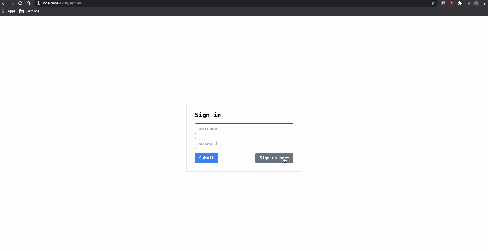

# PANNG Stream Demo

This project is to demo the PANNG tech stack which consists of:

- [Prisma](https://www.prisma.io/)
- [Angular](https://angular.io)
- [NestJS](https://nestjs.com)
- [Nx](https://nx.dev)
- [GraphQL](https://graphql.org/)

## Quick Demo

## References

#### Live-streams

- [Angular Air - Building with the PANNG Stack](https://www.youtube.com/watch?v=EfAuOBbdP7w)
- [Angular Vietnam Office Hour - PANNG Stack with beeman](https://www.youtube.com/watch?v=VS1Z8JcrVe4)

#### Nx Workspace Structures

- [How to structure Nx Workspace pt1](https://www.youtube.com/watch?v=TykF-SsFd9U)
- [How to structure Nx Workspace pt2](https://www.youtube.com/watch?v=PZLTloy-y2k&t=2666s)
- [How to structure Nx Workspace pt3](https://www.youtube.com/watch?v=z026FC6oe-M)

#### Other technologies

- [TailwindCSS](https://tailwindcss.com)
- [NGRX Component Store](https://ngrx.io/guide/component-store)
- [Apollo Client](https://www.apollographql.com/docs/)
- ...and some other technologies on the backend like: `JWT`, `passport`, `bcrypt` etc...

## Quickstart

- Clone the repo
- Run `npm install`
- Run `docker-compose up` (to get PostgresDB started)
- Run `npm run start -- api` (for API)
- Run `npm run start` (for Frontend)
- Go to `localhost:4200`

## License
MIT
